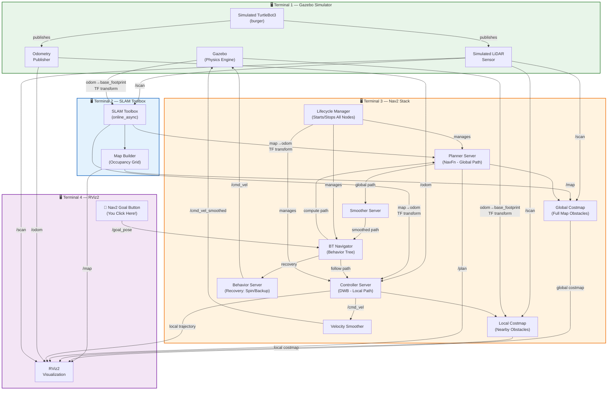
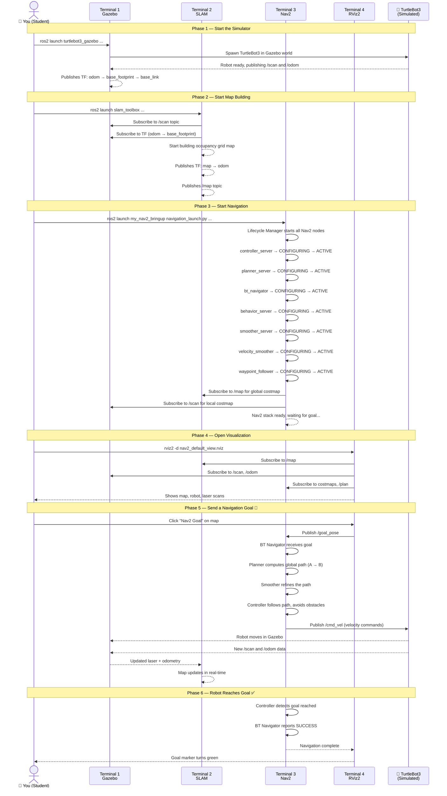
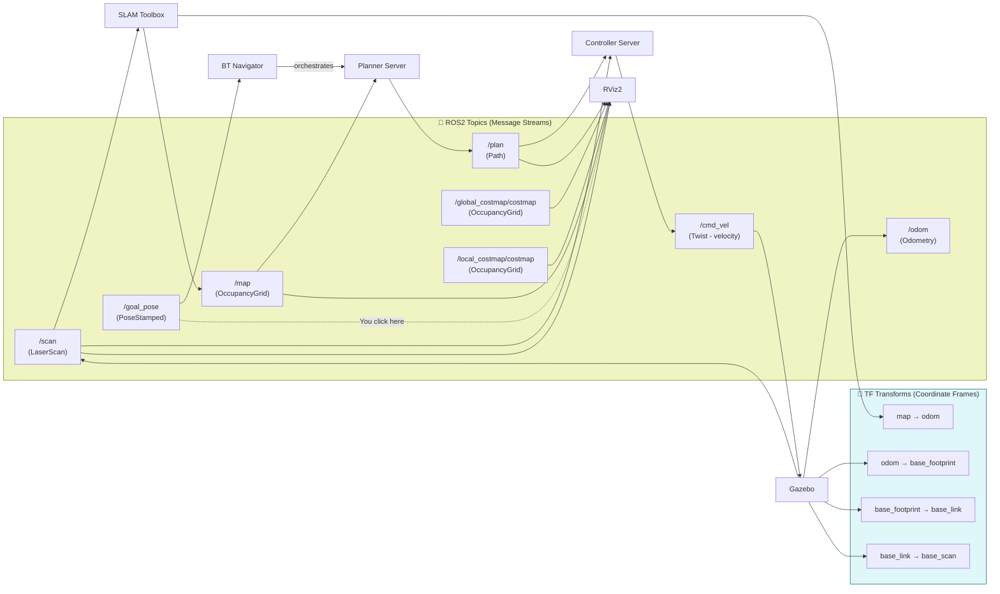
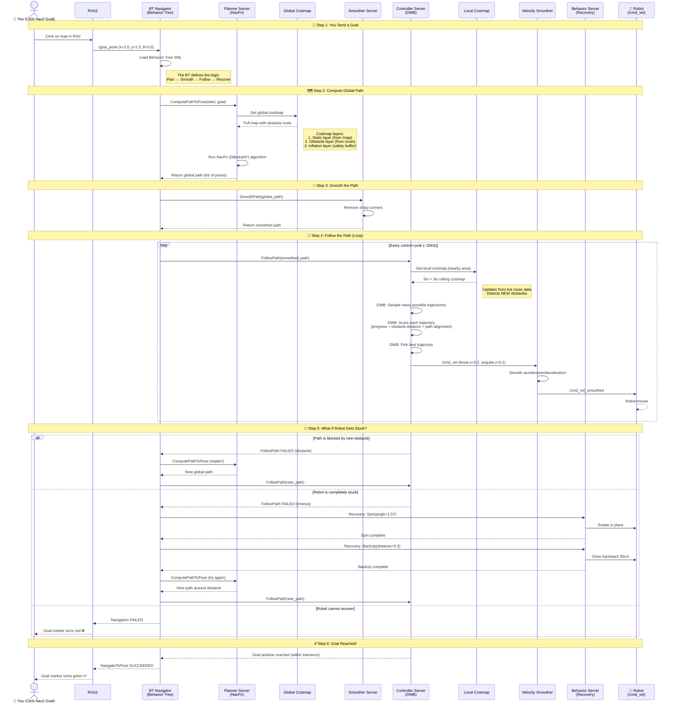
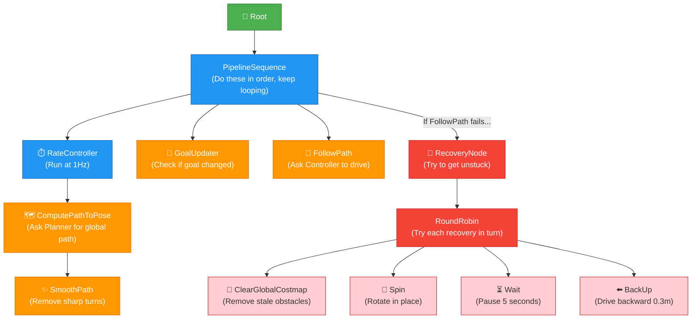
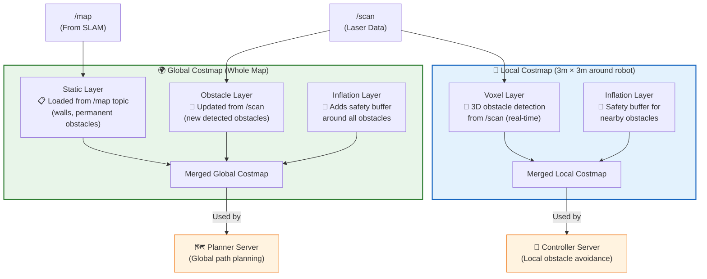
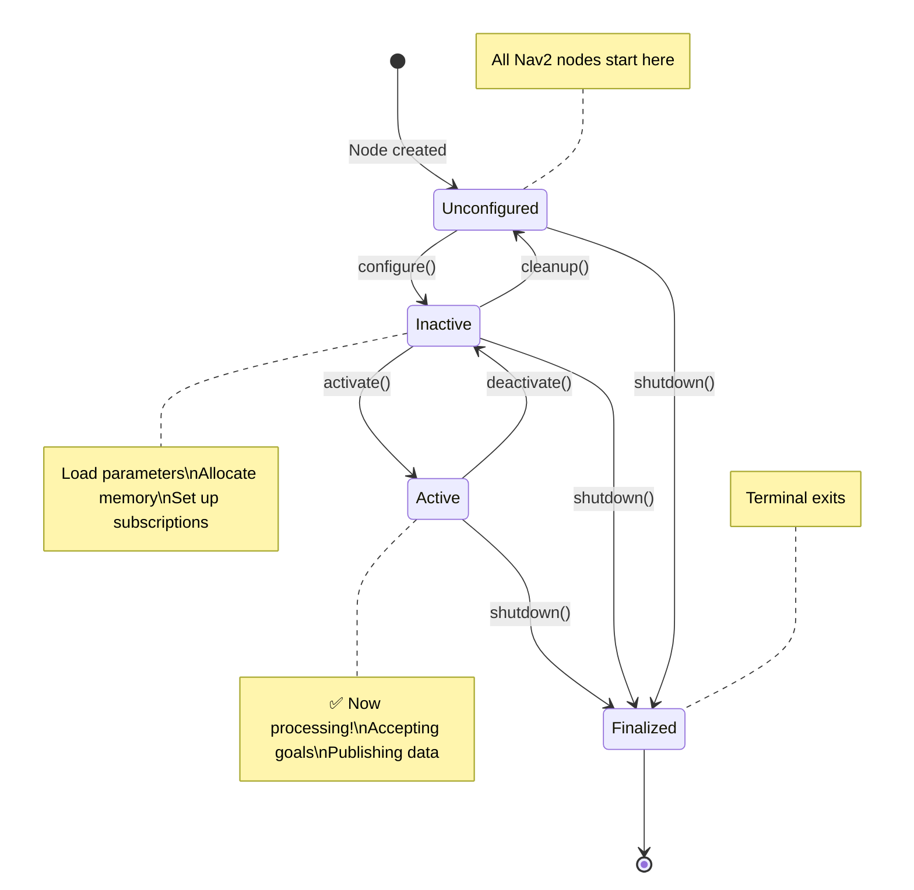

# ROS2 Nav2 Local Workspace Setup Guide

> **Audience:** Students who are relatively new to ROS2 and Nav2.
>
> **Goal:** Learn how to create your own local ROS2 workspace that wraps the shared Nav2 installation, so you can customize configuration files (params, maps, launch files) without modifying the system-wide install.

---

## Table of Contents

1. [Prerequisites](#1-prerequisites)
2. [Background Concepts](#2-background-concepts)
3. [Workspace Structure Overview](#3-workspace-structure-overview)
4. [Step-by-Step Setup](#4-step-by-step-setup)
   - 4.1 [Create the Workspace Folder](#41-create-the-workspace-folder)
   - 4.2 [Create ROS2 Packages](#42-create-ros2-packages)
   - 4.3 [Copy Default Nav2 Files Into Your Package](#43-copy-default-nav2-files-into-your-package)
   - 4.4 [Edit CMakeLists.txt to Install Folders](#44-edit-cmakeliststxt-to-install-folders)
   - 4.5 [Edit package.xml to Declare Dependencies](#45-edit-packagexml-to-declare-dependencies)
5. [Key Change: Use Local Files Instead of Shared Defaults](#5-key-change-use-local-files-instead-of-shared-defaults)
6. [Build the Workspace](#6-build-the-workspace)
7. [Running the Full System (4 Terminals)](#7-running-the-full-system-4-terminals)
8. [System Architecture Diagram — How Everything Connects](#8-system-architecture-diagram--how-everything-connects)
9. [Nav2 Internal Architecture — How Navigation Works](#9-nav2-internal-architecture--how-navigation-works)
10. [What Each Launch File Does](#10-what-each-launch-file-does)
11. [What Each Config / Param File Does](#11-what-each-config--param-file-does)
12. [TF Frame Tree](#12-tf-frame-tree)
13. [Useful Debug Commands](#13-useful-debug-commands)
14. [Common Errors and Fixes](#14-common-errors-and-fixes)
15. [Reference Links](#15-reference-links)

---

## 1. Prerequisites

Before you start, make sure the following are installed on your system:

| Software | Version | How to check |
|----------|---------|-------------|
| Ubuntu | 22.04 (Jammy) | `lsb_release -a` |
| ROS2 | Humble Hawksbill | `printenv ROS_DISTRO` → should say `humble` |
| Nav2 | Installed via apt | `ros2 pkg list \| grep nav2` |
| Gazebo | Classic (11.x) | `gazebo --version` |
| TurtleBot3 packages | Installed via apt | `ros2 pkg list \| grep turtlebot3` |
| colcon | Build tool | `colcon --help` |

If ROS2 Humble is not yet sourced in your terminal, run:

```bash
source /opt/ros/humble/setup.bash
```

> **Tip:** Add this line to your `~/.bashrc` so it runs automatically every time you open a terminal:
> ```bash
> echo "source /opt/ros/humble/setup.bash" >> ~/.bashrc
> ```

---

## 2. Background Concepts

### Why create a separate workspace?

When you install ROS2 and Nav2 via `apt`, all the files go into `/opt/ros/humble/`. This is a **shared, read-only** location. You should **never** edit files there because:

- Updates will overwrite your changes
- Other users/projects share those files
- You might break the system install

Instead, ROS2 lets you create a **local workspace** (called an "overlay") that sits **on top of** the shared install. When both are sourced, ROS2 looks in your local workspace **first**. This means:

- Your custom launch files, params, and maps are used instead of the defaults
- The shared install stays untouched
- You can always go back to defaults by not sourcing your workspace

### What is a ROS2 package?

A package is the smallest unit of code/config that ROS2 can build and find. Every package has:

- A `package.xml` — declares the package name, version, and dependencies
- A `CMakeLists.txt` — tells the build system what to compile and install

Even if your package has no C++ or Python code (just config files), you still need both of these files.

### What does `colcon build` do?

`colcon` reads every package in `src/`, compiles it, and copies the installed files into the `install/` folder. After building, you `source install/setup.bash` so ROS2 knows where to find your packages.

---

## 3. Workspace Structure Overview

Here is the folder structure we will create:

```
~/ros2_ws/nav2/                  ← Your workspace root
├── src/                         ← Source packages (you edit files here)
│   ├── my_nav2_bringup/         ← Our custom copy of nav2_bringup
│   │   ├── CMakeLists.txt
│   │   ├── package.xml
│   │   ├── launch/              ← Launch files (copied from nav2_bringup)
│   │   │   ├── navigation_launch.py    ← ** Modified to use local package **
│   │   │   ├── bringup_launch.py
│   │   │   ├── localization_launch.py
│   │   │   ├── slam_launch.py
│   │   │   ├── rviz_launch.py
│   │   │   └── tb3_simulation_launch.py
│   │   ├── params/              ← Nav2 parameter YAML files
│   │   │   └── nav2_params.yaml
│   │   ├── maps/                ← Pre-built map files
│   │   │   ├── turtlebot3_world.yaml
│   │   │   └── turtlebot3_world.pgm
│   │   └── rviz/                ← RViz display config files
│   │       └── nav2_default_view.rviz
│   ├── my_robot_description/    ← (Placeholder) for custom URDF/meshes
│   │   ├── CMakeLists.txt
│   │   ├── package.xml
│   │   ├── urdf/
│   │   ├── meshes/
│   │   └── worlds/
│   └── my_robot_navigation/     ← (Placeholder) for custom nav configs
│       ├── CMakeLists.txt
│       ├── package.xml
│       ├── config/
│       └── maps/
├── build/                       ← Generated by colcon (don't edit)
├── install/                     ← Generated by colcon (don't edit)
└── log/                         ← Build logs (don't edit)
```

**Three packages:**

| Package | Purpose |
|---------|---------|
| `my_nav2_bringup` | The main one — contains launch files, params, maps, and RViz configs for running Nav2 |
| `my_robot_description` | Placeholder for your robot's URDF model, meshes, and Gazebo world files |
| `my_robot_navigation` | Placeholder for additional navigation configs or custom maps |

> Currently `my_robot_description` and `my_robot_navigation` are empty templates. You will use them later when you build your own robot or create custom maps.

---

## 4. Step-by-Step Setup

### 4.1 Create the Workspace Folder

```bash
mkdir -p ~/ros2_ws/nav2/src
cd ~/ros2_ws/nav2/src
```

### 4.2 Create ROS2 Packages

Use `ros2 pkg create` to generate the skeleton for each package:

```bash
cd ~/ros2_ws/nav2/src

# Main bringup package
ros2 pkg create my_nav2_bringup --build-type ament_cmake

# Robot description placeholder
ros2 pkg create my_robot_description --build-type ament_cmake

# Navigation config placeholder
ros2 pkg create my_robot_navigation --build-type ament_cmake
```

This creates `CMakeLists.txt` and `package.xml` in each folder.

### 4.3 Copy Default Nav2 Files Into Your Package

The default Nav2 config files live in `/opt/ros/humble/share/nav2_bringup/`. We copy them into our `my_nav2_bringup` package:

```bash
cd ~/ros2_ws/nav2/src/my_nav2_bringup

# Copy launch files
cp -r /opt/ros/humble/share/nav2_bringup/launch .

# Copy parameter files
cp -r /opt/ros/humble/share/nav2_bringup/params .

# Copy pre-built maps
cp -r /opt/ros/humble/share/nav2_bringup/maps .

# Copy RViz configuration
cp -r /opt/ros/humble/share/nav2_bringup/rviz .
```

After copying, your `my_nav2_bringup/` folder should have:
```
my_nav2_bringup/
├── CMakeLists.txt
├── package.xml
├── launch/
├── params/
├── maps/
└── rviz/
```

### 4.4 Edit CMakeLists.txt to Install Folders

Open `~/ros2_ws/nav2/src/my_nav2_bringup/CMakeLists.txt` and add this line **before** `ament_package()`:

```cmake
install(DIRECTORY launch params maps rviz
  DESTINATION share/${PROJECT_NAME}
)
```

Your full `CMakeLists.txt` should look like this:

```cmake
cmake_minimum_required(VERSION 3.8)
project(my_nav2_bringup)

if(CMAKE_COMPILER_IS_GNUCXX OR CMAKE_CXX_COMPILER_ID MATCHES "Clang")
  add_compile_options(-Wall -Wextra -Wpedantic)
endif()

find_package(ament_cmake REQUIRED)

if(BUILD_TESTING)
  find_package(ament_lint_auto REQUIRED)
  set(ament_cmake_copyright_FOUND TRUE)
  set(ament_cmake_cpplint_FOUND TRUE)
  ament_lint_auto_find_test_dependencies()
endif()

ament_package()

install(DIRECTORY launch params maps rviz
  DESTINATION share/${PROJECT_NAME}
)
```

**Why this matters:** Without the `install()` line, `colcon build` would not copy your launch/params/maps/rviz files into the `install/` folder, and ROS2 would not be able to find them.

### 4.5 Edit package.xml to Declare Dependencies

Open `~/ros2_ws/nav2/src/my_nav2_bringup/package.xml` and add the Nav2 dependencies so ROS2 knows what this package needs at runtime:

```xml
<?xml version="1.0"?>
<?xml-model href="http://download.ros.org/schema/package_format3.xsd"
  schematypens="http://www.w3.org/2001/XMLSchema"?>
<package format="3">
  <name>my_nav2_bringup</name>
  <version>0.0.0</version>
  <description>Local Nav2 bringup package with custom configs</description>
  <maintainer email="you@example.com">your_name</maintainer>
  <license>Apache-2.0</license>

  <buildtool_depend>ament_cmake</buildtool_depend>

  <exec_depend>nav2_bringup</exec_depend>
  <exec_depend>nav2_map_server</exec_depend>
  <exec_depend>nav2_amcl</exec_depend>
  <exec_depend>nav2_controller</exec_depend>
  <exec_depend>nav2_planner</exec_depend>
  <exec_depend>nav2_bt_navigator</exec_depend>
  <exec_depend>nav2_lifecycle_manager</exec_depend>

  <test_depend>ament_lint_auto</test_depend>
  <test_depend>ament_lint_common</test_depend>

  <export>
    <build_type>ament_cmake</build_type>
  </export>
</package>
```

> `<exec_depend>` means "this package is needed when running" — it tells ROS2 which Nav2 packages must be installed.

---

## 5. Key Change: Use Local Files Instead of Shared Defaults

This is **the most important step.** By default, the copied launch files still point to the **shared** `nav2_bringup` package. We need to change them to point to **our** `my_nav2_bringup` package.

### What to change

In the launch files, look for this line:

```python
bringup_dir = get_package_share_directory('nav2_bringup')
```

Change it to:

```python
bringup_dir = get_package_share_directory('my_nav2_bringup')
```

### Which file we changed

In this project, we made this change in **`navigation_launch.py`** (line 32):

```python
# BEFORE (uses shared system files):
bringup_dir = get_package_share_directory('nav2_bringup')

# AFTER (uses our local files):
bringup_dir = get_package_share_directory('my_nav2_bringup')
```

This means when `navigation_launch.py` runs, it looks for `nav2_params.yaml` inside your local `my_nav2_bringup` package's `params/` folder — **not** the default one in `/opt/ros/humble/share/nav2_bringup/params/`.

### Why this matters

After this change, any edits you make to `~/ros2_ws/nav2/src/my_nav2_bringup/params/nav2_params.yaml` will take effect when you launch Nav2. For example, you could:

- Change the robot speed limits
- Adjust costmap resolution
- Switch planner algorithms
- Tune AMCL localization parameters

> **Note:** The other launch files (`bringup_launch.py`, `localization_launch.py`, `slam_launch.py`, etc.) still reference the shared `nav2_bringup` package. If you want to customize those too, apply the same change to each file. For our basic setup, only `navigation_launch.py` needs to be changed.

---

## 6. Build the Workspace

Every time you change files in `src/`, you need to rebuild:

```bash
cd ~/ros2_ws/nav2

# Source the base ROS2 install first
source /opt/ros/humble/setup.bash

# Build all packages in src/
colcon build

# Source YOUR workspace (this overlays on top of the base install)
source install/setup.bash
```

**Expected output:** You should see all 3 packages built successfully:

```
Starting >>> my_nav2_bringup
Starting >>> my_robot_description
Starting >>> my_robot_navigation
Finished <<< my_nav2_bringup
Finished <<< my_robot_description
Finished <<< my_robot_navigation

Summary: 3 packages finished
```

> **Important:** You must run `source install/setup.bash` in **every new terminal** where you want to use your local packages.

---

## 7. Running the Full System (4 Terminals)

You need **4 separate terminals** to run the complete navigation system. Here is what each one does:

```
┌─────────────────────────────────────────────────────────────┐
│  Terminal 1: Gazebo Simulator     (simulates the robot)     │
│  Terminal 2: SLAM                 (builds a map)            │
│  Terminal 3: Nav2 Stack           (plans paths & navigates) │
│  Terminal 4: RViz                 (visualization & goals)   │
└─────────────────────────────────────────────────────────────┘
```

### Terminal 1 — Gazebo (Robot Simulator)

**Purpose:** Launches the Gazebo physics simulator with a TurtleBot3 robot in the `turtlebot3_world` environment. This simulates the robot, its sensors (LiDAR), and the environment.

```bash
source /opt/ros/humble/setup.bash
export TURTLEBOT3_MODEL=burger
ros2 launch turtlebot3_gazebo turtlebot3_world.launch.py
```

**What you should see:** A Gazebo window opens showing a small robot in a world with obstacles.

> Wait for Gazebo to fully load before starting the next terminals.

### Terminal 2 — SLAM (Map Building)

**Purpose:** Runs the SLAM Toolbox which takes laser scan data from the simulated robot and builds a 2D occupancy grid map in real time.

```bash
source /opt/ros/humble/setup.bash
ros2 launch slam_toolbox online_async_launch.py use_sim_time:=true
```

**What it does:**
- Subscribes to `/scan` (laser data) and `/tf` (robot position)
- Builds and publishes the map on the `/map` topic
- Publishes the `map → odom` transform

> `use_sim_time:=true` tells SLAM to use Gazebo's simulated clock instead of your computer's real clock.

### Terminal 3 — Nav2 Navigation Stack

**Purpose:** Launches the full Nav2 navigation stack — this is the "brain" that plans paths and drives the robot from point A to point B while avoiding obstacles.

```bash
source /opt/ros/humble/setup.bash
source ~/ros2_ws/nav2/install/setup.bash

ros2 launch my_nav2_bringup navigation_launch.py use_sim_time:=true
```

**What it launches (7 nodes):**

| Node | What it does |
|------|-------------|
| `controller_server` | Follows the planned path by sending velocity commands to the robot |
| `smoother_server` | Smooths the planned path so the robot moves more naturally |
| `planner_server` | Computes a global path from start to goal using the NavFn planner |
| `behavior_server` | Handles recovery behaviors (spin, back up, wait) when the robot gets stuck |
| `bt_navigator` | Runs a Behavior Tree that orchestrates planning → controlling → recovery |
| `waypoint_follower` | Allows the robot to follow a sequence of waypoints |
| `velocity_smoother` | Smooths velocity commands to avoid jerky motion |

**Important:** Notice we source **both** the base ROS2 install and our local workspace. This is what makes ROS2 find `my_nav2_bringup` instead of the default `nav2_bringup`.

### Terminal 4 — RViz2 (Visualization)

**Purpose:** Opens RViz2, a visualization tool where you can see the map, the robot, the planned path, costmaps, and set navigation goals by clicking.

```bash
source /opt/ros/humble/setup.bash
source ~/ros2_ws/nav2/install/setup.bash

rviz2 -d ~/ros2_ws/nav2/src/my_nav2_bringup/rviz/nav2_default_view.rviz
```

**What you can do in RViz:**
1. See the map being built in real time
2. See the robot's position and laser scans
3. Click **"2D Pose Estimate"** to tell Nav2 where the robot is (if using AMCL)
4. Click **"Nav2 Goal"** (or "2D Goal Pose") to send a destination — the robot will plan a path and drive there

---

## 8. System Architecture Diagram — How Everything Connects

This diagram shows how the 4 terminals work together. Each terminal runs a different component, and they communicate through **ROS2 topics** (message streams) and **TF transforms** (coordinate frames).

### 8.1 Overall System Data Flow



### 8.2 Startup Sequence — What Happens When You Launch

This sequence diagram shows the **order of events** from when you start each terminal to when the robot navigates:



### 8.3 Topic & TF Communication Map

This shows exactly which **ROS2 topics** connect which components:



---

## 9. Nav2 Internal Architecture — How Navigation Works

This section zooms into **Terminal 3 (Nav2)** to show how the navigation stack works internally when you send a goal.

### 9.1 Nav2 Navigation Flow — From Goal to Motion



### 9.2 Behavior Tree — The Decision-Making Logic

The BT Navigator uses a **Behavior Tree (BT)** to decide what to do. Think of it like a flowchart the robot follows:



**How to read this tree:**
1. The robot **plans a path** at 1 Hz (once per second)
2. The path gets **smoothed**
3. The **controller follows** the smoothed path at ~20 Hz
4. If following fails → try **recovery behaviors** one by one
5. After recovery → go back to step 1 and try again
6. If all recoveries fail → report navigation failure

### 9.3 Costmap Layers — How the Robot "Sees" Obstacles



**Key concept:** The **global costmap** covers the entire map and is used to plan the overall route. The **local costmap** is a small window around the robot and is used to avoid obstacles in real-time.

### 9.4 Lifecycle State Machine — How Nav2 Nodes Start Up

Nav2 nodes use a **lifecycle** pattern. They don't just start running — they go through states:



The **Lifecycle Manager** (from `navigation_launch.py`) automatically transitions all 7 Nav2 nodes through: `Unconfigured → Inactive → Active`. This is why you sometimes see "Waiting for server to be active..." messages in the terminal.

---

## 10. What Each Launch File Does

The `my_nav2_bringup/launch/` folder contains several launch files. Here is what each one is for:

| Launch File | Purpose | Used in our 4-terminal setup? |
|------------|---------|-------------------------------|
| `navigation_launch.py` | Launches the Nav2 navigation stack (controller, planner, behavior tree, etc.). **This is the one we modified.** | **Yes — Terminal 3** |
| `bringup_launch.py` | All-in-one launcher that combines localization + navigation. Can use either SLAM or AMCL. | No (we launch components separately) |
| `localization_launch.py` | Launches map_server (loads a saved map) + AMCL (estimates robot pose on that map). Used when you already have a map. | No (we use SLAM instead) |
| `slam_launch.py` | Launches SLAM Toolbox + map saver. An alternative to running SLAM from `slam_toolbox` directly. | No (we launch SLAM directly) |
| `rviz_launch.py` | Launches RViz with the default Nav2 config. | No (we launch RViz manually) |
| `tb3_simulation_launch.py` | All-in-one simulation: Gazebo + robot spawn + RViz + Nav2. Great for demos but harder to debug. | No (we use separate terminals) |
| `cloned_multi_tb3_simulation_launch.py` | Multi-robot simulation with dynamically specified robot poses. | No (advanced topic) |
| `unique_multi_tb3_simulation_launch.py` | Multi-robot simulation with 2 pre-configured robots (robot1, robot2). | No (advanced topic) |

> **Why do we use 4 separate terminals instead of one all-in-one launch?** Because when you're learning, it's much easier to debug when each component is in its own terminal. You can see which part failed, restart just that part, and read its output clearly.

---

## 11. What Each Config / Param File Does

### Parameter Files (`params/`)

| File | Purpose |
|------|---------|
| `nav2_params.yaml` | **Main config file** — contains all Nav2 node parameters for a single robot: AMCL settings, costmap layers, planner type, controller gains, recovery behaviors, etc. |
| `nav2_multirobot_params_1.yaml` | Parameters for robot1 in a multi-robot setup (topics namespaced to `/robot1/`) |
| `nav2_multirobot_params_2.yaml` | Parameters for robot2 in a multi-robot setup (topics namespaced to `/robot2/`) |
| `nav2_multirobot_params_all.yaml` | Shared template for all robots in multi-robot scenarios (uses `<robot_namespace>` placeholder) |

**Key settings in `nav2_params.yaml` you might want to tune:**

```yaml
# Robot speed limits (in controller_server section)
controller_server:
  ros__parameters:
    FollowPath:
      max_vel_x: 0.26          # Maximum forward speed (m/s)
      min_vel_x: 0.0           # Minimum forward speed
      max_vel_theta: 1.0       # Maximum rotation speed (rad/s)

# Costmap resolution (how detailed the obstacle map is)
local_costmap:
  ros__parameters:
    resolution: 0.05           # 5cm per grid cell

# Planner type
planner_server:
  ros__parameters:
    GridBased:
      plugin: "nav2_navfn_planner/NavfnPlanner"
```

### Map Files (`maps/`)

| File | Purpose |
|------|---------|
| `turtlebot3_world.yaml` | Metadata for the map: image filename, resolution (0.05 m/pixel), origin coordinates, occupancy thresholds |
| `turtlebot3_world.pgm` | The actual map image — a grayscale picture where white = free space, black = obstacles, gray = unknown |

### RViz Config Files (`rviz/`)

| File | Purpose |
|------|---------|
| `nav2_default_view.rviz` | Single-robot visualization: shows map, laser scan, robot model, costmaps, planned path, TF frames |
| `nav2_namespaced_view.rviz` | Multi-robot visualization: uses `<robot_namespace>` for topic names |

---

## 12. TF Frame Tree

Nav2 relies on a chain of coordinate frames connected by transforms (TF). Here is the frame tree used by TurtleBot3:

```
map
 └── odom
      └── base_footprint
           └── base_link
                ├── wheel_left_link
                ├── wheel_right_link
                ├── caster_back_link
                └── base_scan (LiDAR)
```

| Frame | Published by | Meaning |
|-------|-------------|---------|
| `map` → `odom` | SLAM Toolbox (or AMCL) | Global position correction based on map matching |
| `odom` → `base_footprint` | Gazebo (robot odometry) | Robot's position from wheel encoder integration |
| `base_footprint` → `base_link` | Robot State Publisher | Fixed transform (on the ground plane) |
| `base_link` → sensor frames | Robot State Publisher | Sensor positions relative to the robot body |

> You can visualize this tree by running: `ros2 run tf2_tools view_frames` — it generates a PDF showing all frames.

---

## 13. Useful Debug Commands

Open a new terminal and source ROS2:

```bash
source /opt/ros/humble/setup.bash
```

### Check what's running

```bash
# List all active topics
ros2 topic list

# List all active nodes
ros2 node list

# See the frequency of messages on a topic
ros2 topic hz /scan
```

### Inspect data

```bash
# See live odometry data
ros2 topic echo /odom

# See live laser scan data
ros2 topic echo /scan

# Check the map topic
ros2 topic echo /map --once
```

### Debug TF transforms

```bash
# Generate a TF tree PDF
ros2 run tf2_tools view_frames

# Check a specific transform
ros2 run tf2_ros tf2_echo map base_link
ros2 run tf2_ros tf2_echo odom base_footprint
```

### Check Nav2 lifecycle state

```bash
# See which Nav2 nodes are active
ros2 lifecycle list
ros2 lifecycle get /controller_server
```

---

## 14. Common Errors and Fixes

| Error | Cause | Fix |
|-------|-------|-----|
| `Package 'my_nav2_bringup' not found` | You didn't source your workspace | Run `source ~/ros2_ws/nav2/install/setup.bash` |
| `[ERROR] Failed to load node` after build | Build succeeded but install not sourced | Run `source install/setup.bash` in the same terminal |
| `Transform timeout` in Nav2 | SLAM or Gazebo not running yet | Make sure Terminals 1 and 2 are running first |
| `No map received` | SLAM not publishing or use_sim_time mismatch | Add `use_sim_time:=true` to your SLAM launch |
| Gazebo crashes on start | GPU/display issues | Try `export LIBGL_ALWAYS_SOFTWARE=1` before launching |
| Robot doesn't move after setting Nav2 Goal | Nav2 nodes not in "active" state | Check lifecycle states; ensure all 4 terminals are running |
| `colcon build` fails | Missing dependencies | Run `rosdep install --from-paths src --ignore-src -r -y` |

---

## 15. Reference Links

### Official Documentation
- [Nav2 Getting Started Guide](https://docs.nav2.org/getting_started/index.html)
- [Nav2 Configuration Guide](https://docs.nav2.org/configuration/index.html)
- [Nav2 Tutorials — Setting Up Sensors](https://docs.nav2.org/setup_guides/sensors/mapping_localization.html)
- [ROS2 Humble Documentation](https://docs.ros.org/en/humble/index.html)
- [Creating a ROS2 Workspace](https://docs.ros.org/en/humble/Tutorials/Beginner-Client-Libraries/Creating-A-Workspace/Creating-A-Workspace.html)
- [Creating a ROS2 Package](https://docs.ros.org/en/humble/Tutorials/Beginner-Client-Libraries/Creating-Your-First-ROS2-Package.html)

### TurtleBot3
- [TurtleBot3 Simulation Guide (ROBOTIS)](https://emanual.robotis.com/docs/en/platform/turtlebot3/simulation/)
- [TurtleBot3 Navigation Guide](https://emanual.robotis.com/docs/en/platform/turtlebot3/nav_simulation/)

### Tools
- [SLAM Toolbox — GitHub](https://github.com/SteveMacenski/slam_toolbox)
- [Nav2 — GitHub](https://github.com/ros-navigation/navigation2)
- [colcon Documentation](https://colcon.readthedocs.io/en/released/)

### Key ROS2 Concepts
- [Understanding ROS2 Workspaces](https://docs.ros.org/en/humble/Tutorials/Beginner-Client-Libraries/Creating-A-Workspace/Creating-A-Workspace.html)
- [Understanding TF2 (Transforms)](https://docs.ros.org/en/humble/Tutorials/Intermediate/Tf2/Introduction-To-Tf2.html)
- [Understanding Lifecycle Nodes](https://design.ros2.org/articles/node_lifecycle.html)

---

## Quick Reference Card

```
┌─────────────────────────────────────────────────────────────────────┐
│                        QUICK START                                  │
│                                                                     │
│  Build:                                                             │
│    cd ~/ros2_ws/nav2                                                │
│    source /opt/ros/humble/setup.bash                                │
│    colcon build                                                     │
│    source install/setup.bash                                        │
│                                                                     │
│  Run (4 terminals):                                                 │
│                                                                     │
│  T1: source /opt/ros/humble/setup.bash                              │
│      export TURTLEBOT3_MODEL=burger                                 │
│      ros2 launch turtlebot3_gazebo turtlebot3_world.launch.py       │
│                                                                     │
│  T2: source /opt/ros/humble/setup.bash                              │
│      ros2 launch slam_toolbox online_async_launch.py \              │
│        use_sim_time:=true                                           │
│                                                                     │
│  T3: source /opt/ros/humble/setup.bash                              │
│      source ~/ros2_ws/nav2/install/setup.bash                       │
│      ros2 launch my_nav2_bringup navigation_launch.py \             │
│        use_sim_time:=true                                           │
│                                                                     │
│  T4: source /opt/ros/humble/setup.bash                              │
│      source ~/ros2_ws/nav2/install/setup.bash                       │
│      rviz2 -d ~/ros2_ws/nav2/src/my_nav2_bringup/rviz/\            │
│        nav2_default_view.rviz                                       │
│                                                                     │
│  Then in RViz: click "Nav2 Goal" and click on the map!              │
└─────────────────────────────────────────────────────────────────────┘
```

---

*Last updated: April 28, 2026*
